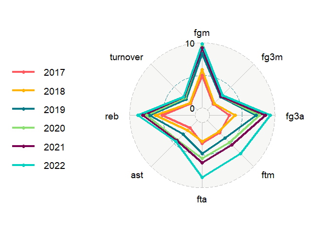

Project 2
================
Michael Dolan

- [Introduction](#introduction)
- [Required Packages](#required-packages)
- [Functions](#functions)
  - [Game Statistics Dataset
    Creation](#game-statistics-dataset-creation)
  - [Contingency Tables of Season, Wins/Losses, and
    Post-Season](#contingency-tables-of-season-winslosses-and-post-season)
  - [Conclusion](#conclusion)

# Introduction

This is a vignette describing how to utilize functions that were created
to pull data from the balldontlie API. This database provides access to
statistics from the NBA, consisting of season averages as well as
individual game stats for players from 1946 to present. This is a free
API that does not require an API key to access.  

# Required Packages

The below packages are required to run the functions.

``` r
library(httr)
library(jsonlite)
library(tidyverse)
```

 

The ggradar package was also used below to create some spider-plots.

``` r
library(ggradar)
```

  This is the code used to install the ggradar package if it has not
been installed previously.

``` r
install.packages("devtools")
devtools::install_github("ricardo-bion/ggradar", dependencies = TRUE)
```

``` r
Player_Search <- GET(url="https://www.balldontlie.io/api/v1/players/?search=larry+nance")
str(Players, max.level=1)
Player <- fromJSON(rawToChar(Player_Search$content))
str(Player, max.level=1)
Player$data
PlayerID <- Player$data[1,1]

Stats_Query <- GET(url =
               "https://www.balldontlie.io/api/v1/stats/?per_page=100&page=2&seasons[]=2022&player_ids[]=434")
Stats <- fromJSON(rawToChar(Stats_Query$content))
Stats$data$game
```

 

# Functions

  `player_game_stats`   This function returns individual game statistics
for a particular player, including the game score, the opponent, and the
outcome of each game. Preseason games are excluded.

This function takes in the following inputs:

- **first_name**: The first name of the player the user is searching
  for. There is no default for this input, and if a name is not supplied
  the function returns an error message prompting the user to input a
  name.

- **last_name**: The last name of the player you are searching for.
  Similarly to first name, if a name is not supplied the function
  returns an error message prompting the user to input a name.

- **season**: The season or group of seasons the user want data for. The
  season is indicated by the year that the season started, so if the
  user wants data on the 2012-2013 season, they would input 2012. If the
  user is searching for multiple seasons, this should be input as a
  vector. If no season is supplied, the default is to return all seasons
  and all games for that player. If seasons are specified for a player
  that did not play in, the function will return only the seasons the
  the player did play. If only seasons that the player did not play are
  specified, or the current season has not officially started and no
  season is specified, then the function returns an error.

- **stats**: The desired stats variables that the user would like
  returned in the dataset. This should be input as a vector if the user
  is seeking multiple stats. The date of each game is always included
  for reference. If no stats are supplied, the default is to provide the
  full set of variables.

- **postseason**: This is a TRUE or FALSE input that provides only
  postseason games if TRUE and only non-postseason games (regular
  season, play-in tournement, etc.) if FALSE. If this argument is not
  provided, the default is to provide all games.

``` r
player_game_stats <- function(first_name=NULL, last_name=NULL,
                              season=NULL, stats=everything(),
                              postseason=NULL, ...){
  
              # Return Error message if First and Last name not specified
                      if (is.null(first_name) | is.null(last_name))
                        {message("Error: First and last name of an NBA player must be specified.")}
                      else {
                        
                      # Find the player's PlayerID to be used later
                      player_search_url <- paste("https://www.balldontlie.io/api/v1/players/?search",
                      paste(first_name, last_name, sep = "+"), sep = "=")
                      player_search <- GET(url=player_search_url)
                      player_info <- fromJSON(rawToChar(player_search$content))
                      playerID <- player_info$data[1,1]
                      
                      # Use the PlayerID to return the players stats for
                      # every game in a season or several seasons
                      stats_url <- paste0("https://www.balldontlie.io/api/v1/stats/?per_page=100",
                                if_else(is.null(season), "",
                                       paste0("&seasons[]=",
                                         paste(season, collapse="&seasons[]=")
                                        )),
                                paste0("&player_ids[]=", playerID),
                                ifelse(is.null(postseason), "",
                                       paste0("&postseason=", postseason))
                                ) 
                      player_stats_api <- GET(url = stats_url)
                      player_content <-
                        fromJSON(rawToChar(player_stats_api$content))
                      player_stats1 <- player_content$data
                      
                  # This API only allows 100 rows to be returned at a time,
                  # so if there are more than 100, a loop is initialized.
                  # The loop pulls the data for each page after the first,
                  # and stores all pages into a list.
                      total_pages <- player_content$meta$total_pages
                      if (total_pages > 1) {
                        page_list <- list()
                        page_list[[1]] <- player_stats1
                        for (i in 2:total_pages) {
                          stats_url <- paste0("https://www.balldontlie.io/api/v1/stats/?per_page=100",
                                paste0("&page=", i),
                                if_else(is.null(season), "",
                                       paste0("&seasons[]=",
                                         paste(season, collapse="&seasons[]=")
                                        )),
                                paste0("&player_ids[]=", playerID),
                                ifelse(is.null(postseason), "",
                                       paste0("&postseason=", postseason))
                                ) 
                      player_stats_api <- GET(url = stats_url)
                      player_content <-
                        fromJSON(rawToChar(player_stats_api$content))
                        page_list[[i]] <- player_content$data
                        }
                        
                        # Each dataset in the list is combine vertically
                        player_stats <- bind_rows(page_list)
                      }
                      
                        # If there is only one page,
                        # that page is stored as player_stats
                      else{player_stats <- player_stats1}
                      
                      # Create a cleaner date variable
                      player_stats$date <-
                        substr(player_stats$game$date, 1, 10)
                      
                      #Create visible season variable and convert it to factor
                      player_stats$season <- as.factor(player_stats$game$season)
                      
                      # Create a Home/Away game variable
                      player_stats$home_away <-
                      if_else(player_stats$team$id == player_stats$game$home_team_id, "Home", "Away")
                      
                      # Create a Win/Loss game variable
                      player_stats$win_loss <-
                        if_else((player_stats$home_away == "Home" &
                                player_stats$game$home_team_score > 
                                player_stats$game$visitor_team_score) | 
                                (player_stats$home_away == "Away" &
                                player_stats$game$visitor_team_score > 
                                player_stats$game$home_team_score),
                                "Win", "Loss")
                      
                      # Create visible score variables
                      player_stats$team_score <- if_else(
                                player_stats$home_away == "Home",
                                player_stats$game$home_team_score,
                                player_stats$game$visitor_team_score)
                      player_stats$opponent_score <- if_else(
                                player_stats$home_away == "Home",
                                player_stats$game$visitor_team_score,
                                player_stats$game$home_team_score)
                      
                      # Create a visible Post-Season variable
                      player_stats$post_season <- player_stats$game$postseason
                      
                      # Create a visible player_team variable
                      player_stats$player_team <- player_stats$team$full_name
                      
                      # Create opponent_team_id variable
                      player_stats$opponent_team_id <-
                        if_else(player_stats$home_away=="Home",
                                player_stats$game$visitor_team_id,
                                player_stats$game$home_team_id)
                      
                      # Create an opponent_team variable
                      # Note: The original dataset only provides team ID
                      # for the opposing team.
                      # Instead of pulling a team dataset with another
                      # API URL and merging the two datasets,
                      # I decided to create a codebook of teams
                      # since there are only 30 that need hardcoding.
                      player_stats$opponent_team <-
                      if_else(player_stats$opponent_team_id==1,
                              "Atlanta Hawks",
                      if_else(player_stats$opponent_team_id==2,
                              "Boston Celtics",
                      if_else(player_stats$opponent_team_id==3,
                              "Brooklyn Nets",
                      if_else(player_stats$opponent_team_id==4,
                              "Charlotte Hornets",
                      if_else(player_stats$opponent_team_id==5,
                              "Chicago Bulls",
                      if_else(player_stats$opponent_team_id==6,
                              "Cleveland Cavaliers",
                      if_else(player_stats$opponent_team_id==7,
                              "Dallas Mavericks",
                      if_else(player_stats$opponent_team_id==8,
                              "Denver Nuggets",
                      if_else(player_stats$opponent_team_id==9,
                              "Detroit Pistons",
                      if_else(player_stats$opponent_team_id==10,
                              "Golden State Warriors",
                      if_else(player_stats$opponent_team_id==11,
                              "Houston Rockets",
                      if_else(player_stats$opponent_team_id==12,
                              "Indiana Pacers",
                      if_else(player_stats$opponent_team_id==13,
                              "LA Clippers",
                      if_else(player_stats$opponent_team_id==14,
                              "Los Angeles Lakers",
                      if_else(player_stats$opponent_team_id==15,
                              "Memphis Grizzlies",
                      if_else(player_stats$opponent_team_id==16,
                              "Miami Heat",
                      if_else(player_stats$opponent_team_id==17,
                              "Milwaukee Bucks",
                      if_else(player_stats$opponent_team_id==18,
                              "Minnesota Timberwolves",
                      if_else(player_stats$opponent_team_id==19,
                              "New Orleans Pelicans",
                      if_else(player_stats$opponent_team_id==20,
                              "New York Knicks",
                      if_else(player_stats$opponent_team_id==21,
                              "Oklahoma City Thunder",
                      if_else(player_stats$opponent_team_id==22,
                              "Orlando Magic",
                      if_else(player_stats$opponent_team_id==23,
                              "Philadelphia 76ers",
                      if_else(player_stats$opponent_team_id==24,
                              "Phoenix Suns",
                      if_else(player_stats$opponent_team_id==25,
                              "Portland Trail Blazers",
                      if_else(player_stats$opponent_team_id==26,
                              "Sacramento Kings",
                      if_else(player_stats$opponent_team_id==27,
                              "San Antonio Spurs",
                      if_else(player_stats$opponent_team_id==28,
                              "Toronto Raptors",
                      if_else(player_stats$opponent_team_id==29,
                              "Utah Jazz",
                      if_else(player_stats$opponent_team_id==30,
                              "Washington Wizards", "ERROR"
                      ))))))))))))))))))))))))))))))
                      
                      # Adjust percentage stats to fix outliers input as whole numbers
                      player_stats$fg_pct <- if_else(player_stats$fg_pct>1, 
                                                     player_stats$fg_pct/100,
                                                     player_stats$fg_pct)
                      
                      player_stats$ft_pct <- if_else(player_stats$ft_pct>1, 
                                                     player_stats$ft_pct/100,
                                                     player_stats$ft_pct)
                      
                      player_stats$fg3_pct <- if_else(player_stats$fg3_pct>1, 
                                                     player_stats$fg3_pct/100,
                                                     player_stats$fg3_pct)
                      
                      # Sort games by date
                      player_stats_sorted <- arrange(player_stats, date)
                      
                      # Select important stats and reorder columns
                      player_stats_clean <- player_stats_sorted %>%
                        select(date, min, pts, reb, ast, stl, blk, fgm, fga,
                               fg_pct, fg3m, fg3a, fg3_pct, ftm, fta, ft_pct,
                               oreb, dreb, turnover, pf, home_away, win_loss,
                               player_team, team_score, opponent_team,
                               opponent_score, post_season, season)
                      
                      # Allow user to select variables and order,
                      # but always keeping the date for reference
                      player_stats_final <- player_stats_clean %>%
                        select(date, stats)
                      
                      # Print final player stats as a tibble
                      as_tibble(player_stats_final)
                      }
}
```

  Here is an example of this function, pulling the post-season games for
Lebron James when he was on the Miami Heat from 2010-2014.

``` r
Lebron_Heat_Playoffs <- player_game_stats(first_name = "lebron",
                                          last_name = "james",
                                          season = c(2010:2013),
                                          postseason = TRUE)
Lebron_Heat_Playoffs
```

    ## # A tibble: 87 × 28
    ##    date       min     pts   reb   ast   stl   blk   fgm   fga fg_pct  fg3m  fg3a fg3_pct   ftm   fta
    ##    <chr>      <chr> <int> <int> <int> <int> <int> <int> <int>  <dbl> <int> <int>   <dbl> <int> <int>
    ##  1 2011-04-16 42:43    21    14     5     1     3     4    14  0.286     0     2   0        13    14
    ##  2 2011-04-18 38:55    29     7     6     0     0    10    19  0.526     1     1   1         8    10
    ##  3 2011-04-21 44:16    24    15     6     1     0     8    15  0.533     1     4   0.25      7    10
    ##  4 2011-04-24 43:33    31     7     6     1     1    11    20  0.55      0     4   0         9    11
    ##  5 2011-04-27 41:40    16    10     8     1     0     5    13  0.385     2     5   0.4       4     5
    ##  6 2011-05-01 39:54    22     6     5     2     2     8    19  0.421     1     3   0.333     5     9
    ##  7 2011-05-03 44:03    35     7     2     1     1    14    25  0.56      2     4   0.5       5     8
    ##  8 2011-05-07 42:48    15     7     4     2     5     6    16  0.375     0     3   0         3     7
    ##  9 2011-05-09 50:17    35    14     3     3     0    12    28  0.429     2     6   0.333     9     9
    ## 10 2011-05-11 45:43    33     7     4     1     1    11    20  0.55      5     7   0.714     6     9
    ## # ℹ 77 more rows
    ## # ℹ 13 more variables: ft_pct <dbl>, oreb <int>, dreb <int>, turnover <int>, pf <int>,
    ## #   home_away <chr>, win_loss <chr>, player_team <chr>, team_score <int>, opponent_team <chr>,
    ## #   opponent_score <int>, post_season <lgl>, season <fct>

    \## Player Average Season Stats Function

`player_season_stats`   This function returns a tibble of average
statistics for a particular player by season.

These are the official averages from the NBA, which may differ from
creating a mean summary using data from the `player_game_stats`function
above because that function includes some games where the player did not
play, resulting in all 0s for that game. These games are excluded from
the official averages.

This function takes in the following inputs:

- **first_name**: The first name of the player the user is searching
  for. There is no default for this input, but if a name is not supplied
  the function returns an error message prompting the user to input a
  name.

- **last_name**: The last name of the player you are searching for.
  Similarly to first name, if a name is not supplied the function
  returns an error message prompting the user to input a name.

- **season**: The season or group of seasons the user want data for. The
  season is indicated by the year that the season started, so if the
  user wants data on the 2012-2013 season, they would input 2012. If the
  user is searching for multiple seasons, this should be input as a
  vector. If no season is supplied, the default is to return only the
  current season averages for that player. If seasons are specified for
  a player that did not play in, the function will return only the
  seasons the the player did play. If only seasons that the player did
  not play are specified, or the current season has not officially
  started and no season is specified, then the function returns an
  error.

- **stats**: The desired stats variables that the user would like
  returned in the dataset. This should be input as a vector if the user
  is seeking multiple stats. The season of each game is always included
  for reference. If no stats are supplied, the default is to provide the
  full set of variables.

 

``` r
player_season_stats <- function(first_name=NULL, last_name=NULL,
                              season=NULL, stats=everything(), ...){
  
              # Return Error message if First and Last name not specified
                      if (is.null(first_name) | is.null(last_name)) {message("Error: First and last name of an NBA player must be specified.")}
                      else {
                        
                      # Find the player's PlayerID to be used later
                      player_search_url <- paste("https://www.balldontlie.io/api/v1/players/?search", paste(first_name, last_name, sep = "+"), sep = "=")
                      player_search <- GET(url=player_search_url)
                      player_info <- fromJSON(rawToChar(player_search$content))
                      playerID <- player_info$data[1,1]
                      
                      # Use the PlayerID to return the players average stats
                      # for a particular season or several seasons.
                      # If no season is specified, it returns the current season.
                      if (is.null(season)) {
                        stats_url <- paste0("https://www.balldontlie.io/api/v1/season_averages?",
                                       paste0("&player_ids[]=", playerID)) 
                      player_stats_api <- GET(url = stats_url)
                      player_content <-
                        fromJSON(rawToChar(player_stats_api$content))
                      player_stats <- player_content$data
                      } 
                      
                  # If a season is specified, the function initiates a loop.
                  # This API only allows 1 season to be returned at a time, 
                  # so the loop pulls the queries the API to pull data for 
                  # each season and stores each season into a list.
                      else{
                        season_list <- list()
                        for (i in season) {
                      stats_url <- paste0("https://www.balldontlie.io/api/v1/season_averages?",
                                       paste0("&season=", i),
                                paste0("&player_ids[]=", playerID)) 
                      player_stats_api <- GET(url = stats_url)
                      player_content <-
                        fromJSON(rawToChar(player_stats_api$content))
                      season_list[[i]] <- player_content$data
                        }
                        
                      # Each season in the list is combine vertically
                      player_stats <- bind_rows(season_list)
                      }
                      
                      # Sort games by season from most recent down
                      player_stats_sorted <- arrange(player_stats, desc(season))
                      
                      # Convert the season variable into a factor
                      player_stats_sorted$season <- as.factor(player_stats_sorted$season)
                      
                      # Select important stats and reorder columns
                      player_stats_clean <- player_stats_sorted %>%
                        select(season, games_played, min, pts, reb, ast, stl,
                               blk, fgm, fga, fg_pct, fg3m, fg3a, fg3_pct,
                               ftm, fta, ft_pct, oreb, dreb, turnover, pf)
                      
                      # Allow user to select variables and order,
                      # but always keeping the season for reference
                      player_stats_final <- player_stats_clean %>%
                        select(season, stats)
                      
                      # Print final player stats as a tibble
                      as_tibble(player_stats_final)
                      }
                      }
```

  \## Player_Season_Stats Example Here is an example of this function,
pulling Michael Jordan’s average points, assists, rebounds, blocks, and
steals for every season in his career.

``` r
Michael_Jordan_avgs <- player_season_stats(first_name = "Michael",
                                           last_name = "Jordan",
                                           stats = c("pts", "ast", "reb", "blk", "stl"),
                                           season = c(1980:2005))
Michael_Jordan_avgs
```

    ## # A tibble: 15 × 6
    ##    season   pts   ast   reb   blk   stl
    ##    <fct>  <dbl> <dbl> <dbl> <dbl> <dbl>
    ##  1 2002    20    3.79  6.06  0.48  1.5 
    ##  2 2001    22.9  5.17  5.65  0.43  1.42
    ##  3 1997    28.7  3.45  5.79  0.55  1.72
    ##  4 1996    29.6  4.29  5.88  0.54  1.71
    ##  5 1995    30.4  4.29  6.62  0.51  2.2 
    ##  6 1994    26.9  5.29  6.88  0.76  1.76
    ##  7 1992    32.6  5.49  6.69  0.78  2.83
    ##  8 1991    30.0  6.11  6.39  0.94  2.28
    ##  9 1990    31.5  5.52  6     1.01  2.72
    ## 10 1989    33.6  6.33  6.89  0.66  2.77
    ## 11 1988    32.5  8.02  8.05  0.8   2.89
    ## 12 1987    35.0  5.91  5.48  1.6   3.16
    ## 13 1986    37.1  4.6   5.24  1.52  2.88
    ## 14 1985    22.7  2.94  3.56  1.17  2.06
    ## 15 1984    28.2  5.87  6.51  0.84  2.39

  \# Exploratory Data Analysis To demonstrate these functions, I will be
performing a basic exploratory data analysis using data from calls to
the above two functions. The analysis will be about one particular NBA
player, Jayson Tatum, and look at his stats throughout his career to
investigate the following questions:

1.  Has Jayson Tatum improved as a player since he has come into the
    league?  
2.  If he has improved, how much has he improved and in what areas?  
3.  Is there a difference between how Jayson Tatum plays in the regular
    season compared to the post-season?

## Game Statistics Dataset Creation

The below code creates a dataset of stats for all games played by Jayson
Tatum. This data will be used for all game-level analyses below.

``` r
tatum_all_games <- player_game_stats(first_name = "jayson", last_name = "tatum")
tatum_all_games
```

    ## # A tibble: 550 × 28
    ##    date       min     pts   reb   ast   stl   blk   fgm   fga fg_pct  fg3m  fg3a fg3_pct   ftm   fta
    ##    <chr>      <chr> <int> <int> <int> <int> <int> <int> <int>  <dbl> <int> <int>   <dbl> <int> <int>
    ##  1 2017-10-17 36:32    14    10     3     0     0     5    12  0.417     1     2   0.5       3     3
    ##  2 2017-10-18 36:32     8     9     2     1     0     3     7  0.429     0     1   0         2     5
    ##  3 2017-10-20 32:45    15     8     0     0     3     3     8  0.375     0     2   0         9     9
    ##  4 2017-10-24 31:08    22     4     2     4     2     9    15  0.6       4     6   0.667     0     0
    ##  5 2017-10-26 27:49    12     2     3     1     0     3     6  0.5       1     3   0.333     5     5
    ##  6 2017-10-28 31:28    20     5     0     0     0     6     9  0.667     2     2   1         6     7
    ##  7 2017-10-30 35:18     7    11     2     0     3     2     7  0.286     2     4   0.5       1     2
    ##  8 2017-11-01 26:25    12     4     2     0     0     4     7  0.571     1     2   0.5       3     4
    ##  9 2017-11-03 29:48    13     6     3     0     0     4    10  0.4       2     3   0.667     3     4
    ## 10 2017-11-05 27:19    13     4     3     1     0     5     8  0.625     2     4   0.5       1     2
    ## # ℹ 540 more rows
    ## # ℹ 13 more variables: ft_pct <dbl>, oreb <int>, dreb <int>, turnover <int>, pf <int>,
    ## #   home_away <chr>, win_loss <chr>, player_team <chr>, team_score <int>, opponent_team <chr>,
    ## #   opponent_score <int>, post_season <lgl>, season <fct>

 

## Contingency Tables of Season, Wins/Losses, and Post-Season

The below code creates a two-way contingency table displaying Jayson
Tatum’s proportion of wins and losses for each season. This table shows
that, although his winning percentage has not consistently improved
every season, he has had considerable success throughout his career with
a winning percentage above 60% in every season except 2020, and his most
recent year was one of his most successful in this metric.

``` r
prop.table(table(tatum_all_games$season, tatum_all_games$win_loss),
           margin = 1)
```

    ##       
    ##             Loss       Win
    ##   2017 0.3500000 0.6500000
    ##   2018 0.3932584 0.6067416
    ##   2019 0.3255814 0.6744186
    ##   2020 0.5000000 0.5000000
    ##   2021 0.3663366 0.6336634
    ##   2022 0.3333333 0.6666667

  The below code creates a two-way contingency table displaying Tatum’s
the proportion of wins and losses in the regular season (labeled as
FALSE) and the playoffs (labeled as TRUE). This table shows that Jayson
Tatum has a slightly lower winning percentage in the postseason compared
to in the regular season. However, one would expect a drop in postseason
due to the increased level of competition. The playoff winning
percentage is still over 50%, which means that overall one would expect
Tatum’s team to win a 7-game series most of the time.

``` r
prop.table(table(tatum_all_games$post_season, tatum_all_games$win_loss),
           margin = 1)
```

    ##        
    ##              Loss       Win
    ##   FALSE 0.3574561 0.6425439
    ##   TRUE  0.4468085 0.5531915

  The below code creates a three-way contingency table displaying
Tatum’s total number of wins and losses in the regular season (labeled
as FALSE) and the playoffs (labeled as TRUE), with a table for each
season he has played. This table shows that Tatum’ had a very successful
first year in both the regular season and the playoffs, but Tatum’s most
recent two years have been among his most successful. Every 4 wins in
the playoffs mean that the team advances another round, with 4 rounds
total, which means that Tatum made it to the NBA Finals in 2021 and the
Conference finals three other years including 2022. Although there is
some fluctuation in playoff wins each year, this table shows a general
upward trend.

``` r
table(tatum_all_games$post_season, tatum_all_games$win_loss, tatum_all_games$season)
```

    ## , ,  = 2017
    ## 
    ##        
    ##         Loss Win
    ##   FALSE   27  54
    ##   TRUE     8  11
    ## 
    ## , ,  = 2018
    ## 
    ##        
    ##         Loss Win
    ##   FALSE   31  49
    ##   TRUE     4   5
    ## 
    ## , ,  = 2019
    ## 
    ##        
    ##         Loss Win
    ##   FALSE   21  48
    ##   TRUE     7  10
    ## 
    ## , ,  = 2020
    ## 
    ##        
    ##         Loss Win
    ##   FALSE   32  35
    ##   TRUE     4   1
    ## 
    ## , ,  = 2021
    ## 
    ##        
    ##         Loss Win
    ##   FALSE   27  50
    ##   TRUE    10  14
    ## 
    ## , ,  = 2022
    ## 
    ##        
    ##         Loss Win
    ##   FALSE   25  57
    ##   TRUE     9  11

  \## Box Plots and Numerical Summaries of Points The below code creates
a numerical summary of Tatum’s mean points the regular season and the
post-season (calculated from the individual games dataset) as well as
standard deviations for each season. This data is also visualize with
box plots for each season. One question in analyzing any sports player
is consistency. How much do their performances vary from night-to-night?
The below data and plots show that, although Tatum’s regular season
points have grown consistently from year-to-year, he standard deviation
has also trended upward, indicating that he is less consistent. In the
playoffs, however, the box plots show that Tatum’s point variability has
not increases dramatically as he has progressed, meaning that he is
reasonably consistent in the post-season.

``` r
tatum_all_games %>% group_by(post_season, season) %>% summarize(mean = mean(pts, na.rm = TRUE), sd = sd(pts, na.rm = TRUE))
```

    ## `summarise()` has grouped output by 'post_season'. You can override using the `.groups` argument.

    ## # A tibble: 12 × 4
    ##    post_season season  mean    sd
    ##    <lgl>       <fct>  <dbl> <dbl>
    ##  1 FALSE       2017    13.9  5.28
    ##  2 FALSE       2018    15.5  6.30
    ##  3 FALSE       2019    22.4  9.17
    ##  4 FALSE       2020    26   10.7 
    ##  5 FALSE       2021    26.8  8.73
    ##  6 FALSE       2022    27.1 12.1 
    ##  7 TRUE        2017    18.5  6.10
    ##  8 TRUE        2018    15.2  6.98
    ##  9 TRUE        2019    25.7  6.02
    ## 10 TRUE        2020    30.6 15.9 
    ## 11 TRUE        2021    25.6  8.67
    ## 12 TRUE        2022    27.2  9.89

``` r
ggplot(tatum_all_games, aes(x=season, y=pts)) +
  geom_boxplot(fill = "green") +
  labs(x = "Season", y = "Points", title = "Points per Season by Post-Season") +
  facet_wrap(~post_season)
```

<!-- -->   \## Box Plots and Numerical
Summaries of Field Goal Percentage We can also run the same analysis on
field goal percentage. Field goal percentage can be used to see how
efficient a player is, since point could just be the result of taking
more shots and not making a greater proportion of shots. This analysis
shows that Tatum’s field goal percentage in the regular season has
decreased slightly since his first season, and his most recent year has
been his worst and least consistent yet. However, during the post-season
his field goal percentage was one of his best, with a moderate level of
variability compared to previous seasons.

``` r
tatum_all_games %>% group_by(post_season, season) %>% summarize(mean = mean(fg_pct, na.rm = TRUE), sd = sd(fg_pct, na.rm = TRUE))
```

    ## `summarise()` has grouped output by 'post_season'. You can override using the `.groups` argument.

    ## # A tibble: 12 × 4
    ##    post_season season  mean     sd
    ##    <lgl>       <fct>  <dbl>  <dbl>
    ##  1 FALSE       2017   0.472 0.144 
    ##  2 FALSE       2018   0.434 0.145 
    ##  3 FALSE       2019   0.431 0.164 
    ##  4 FALSE       2020   0.441 0.141 
    ##  5 FALSE       2021   0.452 0.131 
    ##  6 FALSE       2022   0.419 0.178 
    ##  7 TRUE        2017   0.462 0.100 
    ##  8 TRUE        2018   0.412 0.126 
    ##  9 TRUE        2019   0.438 0.0911
    ## 10 TRUE        2020   0.396 0.117 
    ## 11 TRUE        2021   0.428 0.132 
    ## 12 TRUE        2022   0.444 0.121

``` r
ggplot(tatum_all_games, aes(x=season, y=fg_pct)) +
  geom_boxplot(fill = "green") +
  labs(x = "Season", y = "Points", title = "FG% per Season by Post-Season") +
  facet_wrap(~post_season)
```

<!-- -->   \## Density Plots and
Numerical Summaries of 3-Point Field Goal Percentage The below code runs
the same analysis on 3-point field goal percentage (a important part of
Tatum’s game), but swaps out the box plots for density plots. The
summary statistics show that Tatum’s regular season 3-point percentage
has been trending downward, but his 3-point percentage in the playoffs
has been trending upward. This supports the idea that Tatum elevates his
game during the playoffs.

``` r
tatum_all_games %>% group_by(post_season, season) %>% summarize(mean = mean(fg3_pct, na.rm = TRUE), sd = sd(fg3_pct, na.rm = TRUE))
```

    ## `summarise()` has grouped output by 'post_season'. You can override using the `.groups` argument.

    ## # A tibble: 12 × 4
    ##    post_season season  mean     sd
    ##    <lgl>       <fct>  <dbl>  <dbl>
    ##  1 FALSE       2017   0.426 0.331 
    ##  2 FALSE       2018   0.367 0.304 
    ##  3 FALSE       2019   0.353 0.220 
    ##  4 FALSE       2020   0.369 0.188 
    ##  5 FALSE       2021   0.330 0.195 
    ##  6 FALSE       2022   0.304 0.187 
    ##  7 TRUE        2017   0.268 0.157 
    ##  8 TRUE        2018   0.300 0.319 
    ##  9 TRUE        2019   0.345 0.161 
    ## 10 TRUE        2020   0.366 0.0813
    ## 11 TRUE        2021   0.389 0.189 
    ## 12 TRUE        2022   0.313 0.198

``` r
ggplot(tatum_all_games, aes(x=fg3_pct)) +
  geom_density(alpha = 0.2, aes(fill=post_season)) +
  labs(x = "3-Point Percentage", y = "Proportion of Games", title = "3-Point Percentage Histogram") +
  scale_fill_discrete(name="Post-Season") +
  facet_wrap(~season)
```

<!-- -->   \## Assists-to-Turnovers
Scatterplots Another important part of any NBA players game is
facilitation and ball security. This is commonly analyzed with the
assist-to-turnover ratio, which looks at how many assist a player gets
by passing another player the ball who then scores, compared to how many
times the player loses the ball to the opposing team. The below code
creates several scatterplots by season, with turnovers on the x-axis and
assists on the y-axis. These plots show that as Tatum’s assist numbers
increased over his career, generally so did his turnovers, which means
there may still be room for improvement in his ball security. However,
in his most recent post-season Tatum did not have any games with over 5
turnovers, which does show some increased ball security in the
post-season as well as seasonal improvement.

``` r
ggplot(tatum_all_games, aes(x=ast, y=turnover)) + 
  geom_point(aes(col=post_season), position="jitter") + 
  labs(x = "Assists", y = "Turnovers", title = "Assists to Turnovers") + 
  scale_color_discrete(name="Post-Season") +
  facet_wrap(~ season)
```

<!-- -->   \## Spider Plot of Average
Stats Finally, lets look at some average statistics not yet discussed
that can be neatly displayed together. The below code calls the
`player_season_stats` function and uses that data to create a spider
plot by season of average field goal makes, 3-point makes, 3-point
attempts, free-throw makes, free-throw attempts, assist, rebounds, and
turnovers. These statistics were chosen because they all have similar
scales that can be shown on the plot cleanly. This chart shows that in
most statistics Tatum has improved on average from season to season. He
has also increase his number of attempts, which could be the reason why
some of his percentages have decreased as shown previously. For example,
Tatum’s 3-point makes took a big jump in his third year, as did his
attempts, but his makes have not dramatically improved since then even
though his attempts continue to increase.

``` r
tatum_season_avgs <- player_season_stats(first_name = "jayson", last_name = "tatum", season=c(2017:2023), stats = c("fgm", "fg3m", "fg3a", "ftm", "fta", "ast", "reb", "turnover"))
tatum_season_avgs
```

    ## # A tibble: 6 × 9
    ##   season   fgm  fg3m  fg3a   ftm   fta   ast   reb turnover
    ##   <fct>  <dbl> <dbl> <dbl> <dbl> <dbl> <dbl> <dbl>    <dbl>
    ## 1 2022    9.82  3.24  9.27  7.18  8.41  4.62  8.77     2.88
    ## 2 2021    9.27  3     8.51  5.26  6.16  4.36  8.03     2.84
    ## 3 2020    9.52  2.95  7.65  4.8   5.49  4.31  7.38     2.66
    ## 4 2019    8.36  2.86  7.11  3.85  4.74  3.03  6.97     2.35
    ## 5 2018    5.9   1.47  3.94  2.47  2.89  2.13  6.04     1.54
    ## 6 2017    4.96  1.31  3.03  2.66  3.23  1.6   5.03     1.43

``` r
ggradar(tatum_season_avgs, group.point.size = 2, values.radar = c("0", "","10"), grid.mid = 5, grid.max = 10)
```

<!-- -->

## Conclusion

The above exploratory data analysis shows that Jayson Tatum has
consistently improved his statistics overall in the regular season, with
the most notable improvements being in average points, assists,
rebounds, and playoff 3-point percentage. It also shows that Tatum has a
strong tendency to elevate his game during the post-season, especially
in his two most recent seasons.  
   
There are, however, some areas for improvement. Facilitation with ball
security is one, although he has shown improvements in this metric
during the playoffs. Consistency from game to game in the regular season
is another area that could be improved, although this is not as much of
an issue in the playoffs.

  Another area of potential improvement would be regular season 3-point
percentage. A way to improve this may be better shot selection as
opposed to increasing 3-point shot attempts. It may be wise to go to the
hoop more as opposed to shooting more 3-pointers. Driving to the basket
can draw more fouls, and as Tatum’s average free-throw attempts have
increased from season-to-season, his average free-throw makes have
increase at a commensurate rate.
